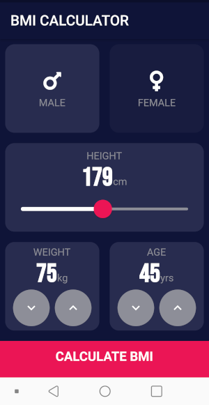
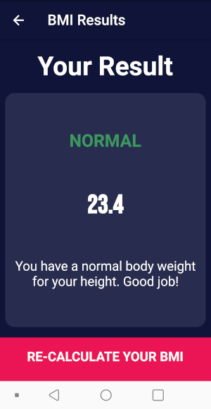

# BMI Calculator 💪

Body Mass Index Calculator inspired by the beautiful designs made by [Ruben Vaalt](https://dribbble.com/shots/4585382-Simple-BMI-Calculator). 

Authored as part of the London App Brewery Flutter UI course.

## Uses

- Flutter themes.
- Flutter Routes and Navigator.
- Stateful and Stateless Widgets with parameters, including VoidCallback functions as parameters for onPressed and onTap events. 
- GestureDetector Widget.
- Custom colour palettes through a constants file. 
- Custom Flutter Widgets.
- Dart Enums and the Ternary Operator.
- Composition, inheritance.

